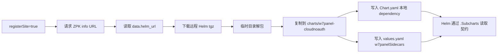

# ZPK 五类应用及 Helm Sidecar 的打包、依赖与存储说明

> 本文基于仓库当前工作树实现整理，覆盖原生应用、应用插件、传统应用、Helm/K8sYaml 应用和系统镜像。文中“当前实现”指当前 Go/Vue 文件表达的运行路径，不把 `DEPENDENCY_EXPORTS_DESIGN.md` 中尚未落地的建议当成现有能力。
>
> 最后核对日期：2026-09-11。

## 1. 结论摘要

五类应用最终都由 `PackManifestToHelm` 生成一个 Helm Chart，但内部有四种主要打包路径：

| 应用类型 | manifest 值 | 打包路径 | 主要运行资源 | 运行时存储 |
| --- | --- | --- | --- | --- |
| 原生应用 | `docker` | 通用工作负载生成器 | Deployment/StatefulSet/DaemonSet、Service、Ingress、Job | 外部 PVC、StatefulSet claim template、emptyDir 或 hostPath |
| 应用插件 | `app-plugin` | 应用插件专用 Job 打包器 | Helm hook Job，可选 MicroApp/Site；没有自己的常驻 Workload | 复用所选传统应用的 `site-storage` PVC |
| 传统应用 | `tradition` | 通用工作负载生成器 + 传统应用增强 | Workload、Service、Ingress、代码/NGINX Job、可选 NGINX 子 Chart | 安装方传入的 `PVC_NAME`，主要挂载为 `site-storage` |
| Helm/K8sYaml 应用 | `helm` | 解包并改写用户 Chart，或把 YAML 写入 templates | 完全由用户 Chart/YAML 决定，ZPK 可追加子 Chart、MicroApp、Site、sidecar | 完全由用户 Chart/YAML 决定 |
| 系统镜像 | `system-image` | 通用工作负载生成器 | Sysbox Deployment、Service、Job | 安装方传入的 `PVC_NAME`，挂载到 `/system-rootfs` |

最重要的边界：

- `platform.depends` 描述安装依赖关系，但真正被内嵌进 `charts/` 的普通子应用来自同一制品下保存的 `*/manifest.yaml`，不是仅凭一条 `depends` 记录即时下载。
- `type: out` 是单独安装的外部依赖；`type: in` 是随当前包保存/打包的子应用关系。
- 原生应用、传统应用和系统镜像都可以声明 PVC volume，但通用打包器不会为 Deployment 自动创建 PVC。空 `claimName` 在渲染时取 `.Values.PVC_NAME`。
- 只有 StatefulSet 的 `platform.volumeClaimTemplates` 会随 Workload 生成 PVC；应用插件不拥有 PVC；Helm 应用是否创建 PVC 取决于用户 Chart。
- 前端 zip 不会塞进最终 Helm tgz。Helm 里生成的是 `MicroApp` CR，前端文件仍由 ZPK 的附件下载接口提供。

## 2. 总体数据与打包流程

```mermaid
flowchart TD
    UI[制品编辑器] -->|保存 manifest.yaml 和子应用 manifest| Depot[本地 Depot]
    UI -->|上传 zip/tgz| Storage[/Storage/YYYYMM/hash.ext]
    Depot --> DB[(SQLite/MySQL\nFormula/Version/Setting)]
    Depot --> OCI[(OCI Registry\nmanifest、图标、源码、前端、原始 Helm 附件)]
    Depot --> Load[GetFormula 加载并兼容旧 manifest]
    OCI -->|本地缺失时恢复| Load
    Storage --> Load
    Load --> Pack[PackManifestToHelm]
    Pack --> Native[通用 Workload\n原生/系统镜像]
    Pack --> Plugin[应用插件 Job]
    Pack --> Tradition[传统应用增强 Workload]
    Pack --> UserHelm[用户 Helm/YAML 解包改写]
    Native --> TGZ[最终聚合 Helm tgz]
    Plugin --> TGZ
    Tradition --> TGZ
    UserHelm --> TGZ
    TGZ -->|一次性 token URL| Installer[面板安装端]
```

### 2.1 编辑和保存

1. 根应用保存在 `manifest.yaml`。
2. 子应用保存在 `<child-identifie>/manifest.yaml`。
3. 上传的后端 zip、前端 zip、Helm tgz 统一写到逻辑路径 `/Storage/YYYYMM/<md5>.<ext>`，manifest 中记录成 `file:///Storage/...`。
4. `Formula`、版本、状态、商品信息、公式级基础信息等结构化元数据存入 SQLite 或 MySQL；完整 manifest 内容仍以文件/OCI layer 为主。
5. 公式级 `Setting.BaseInfo` 会在读取、发布和返回时覆盖版本 manifest 的名称、描述、注解、单次安装、集群权限和站点注册字段。

### 2.2 发布到 OCI Registry

发布时 `Depot.packToOci` 将以下内容作为 OCI artifact layers 推送到内置 Registry：

| 内容 | OCI media type |
| --- | --- |
| 图标 | `application/vnd.w7.formula.icon+png` |
| manifest 文件集合 JSON | `application/vnd.w7.formula.files.json+json` |
| 后端源码 zip | `application/vnd.w7.formula.code.zip+zip` |
| 各应用前端 zip | `application/vnd.w7.formula.code.web.zip+zip<identify>` |
| 各应用原始 Helm tgz | `application/vnd.w7.formula.helm.zip+zip<identify>` |

OCI repository 名为：

```text
<DEPOT_OCI_NAMESPACE>/<formula-identifie 中的 - 替换为 _>
```

本地缓存缺文件时，`GetFormula` 会根据 OCI layer 把 manifest、源码、前端包、Helm 包恢复到 Depot。

### 2.3 生成最终 Helm 包

`PackFormulaToHelmAndPack` 的落点为：

```text
<DEPOT_LOCAL_BASE_DIR>/Helm/Formula/<application-identifie>/  # 临时 Chart 目录
<DEPOT_LOCAL_BASE_DIR>/Helm/<identify_with_underscores>-<versionId>.tgz
```

打包完成后临时 `Helm/Formula` 目录会删除，tgz 保留并复用。需要按订单或角色替换 MicroApp bindings 时，会在同目录生成带 SHA-256 缓存键的动态 tgz。

`/zpk/respo/info/...` 返回最终 `helm_url`；下载地址是 `/zpk/zip/download/<token>`。普通动态 Helm token 使用内存映射且下载后删除映射，后端代码包还支持由应用、版本、路径签名的稳定 token。

## 3. manifest 中保存了什么

核心模型在 `common/logic/manifest.go`。

### 3.1 顶层字段

| 字段 | 内容 | 谁使用 |
| --- | --- | --- |
| `application` | 名称、标识、作者、类型、版本、注解、是否只装一次、是否需要集群权限、是否注册站点 | UI、打包分流、Chart 标签、Site/sidecar、商品逻辑 |
| `platform` | 容器、Workload、存储、网络、启动参数、依赖、Shell、Helm/应用插件专属配置 | Helm 打包器和安装端 |
| `bindings` | 菜单、角色、加载方式、后端路由、请求代理、前端 props | `MicroApp` CR 和动态市场菜单 |
| `source` | 后端源码或应用插件/传统应用代码包，通常是 zip | Kaniko 构建 Job 或代码安装 Job |
| `web` | 前端构建产物 zip | 是否生成 MicroApp，以及 info 接口的 `webzip_url` |
| `v` / `version` | manifest 协议版本 | 对外 info 返回时设置为 3 |

### 3.2 `application`

关键字段如下：

- `name`、`identifie`、`description`、`author`、`version`。
- `type`：五类应用的分流字段。
- `once`：是否只允许安装一次。传统应用和系统镜像的 UI 强制为 `false`。
- `clusterPrivileges`：为生成型应用追加 ServiceAccount、ClusterRole、ClusterRoleBinding 和 service-account-token Secret。
- `registerSite`：根 Chart 追加 `Site` CR，同时自动引入 `w7panel-cloudnoauth` sidecar Chart。
- `annotation`：直接参与 Pod 注解；传统应用和系统镜像也在这里保存类型专属元数据。

### 3.3 `platform`

| 字段 | 说明 |
| --- | --- |
| `baseInfo` | 兼容旧编辑器的应用名称/标识/描述 |
| `container-v2` | 主容器和 init container；镜像、命令、参数、端口、环境变量、probe、生命周期、挂载、安全上下文等 |
| `volumes` | Kubernetes Pod volumes；支持 PVC、emptyDir、hostPath 等标准结构 |
| `volumeClaimTemplates` | 仅 StatefulSet 会渲染 |
| `workload` | `Deployment`、`StatefulSet`、`DaemonSet` 及 updateStrategy |
| `ingress` | Ingress 路由、后端、Header/Query/Method 匹配和重写 |
| `startParams` | 安装参数定义，同时会映射成容器和 Job 环境变量 |
| `depends` | 内嵌/外部依赖、版本、来源、是否必须、是否多实例、绑定 releaseName、依赖启动参数 |
| `shells` | install/upgrade/uninstall/custom 等生命周期 Shell |
| `runtimeClassName` / `hostUsers` | Sysbox、GPU 等运行时设置 |
| `helm` | Helm/K8sYaml 应用的 Chart 来源、版本、values 覆盖和附加 YAML |
| `plugin` | 应用插件选择的传统应用、版本、语言和镜像模板 |

旧 `platform.container` 会由 `GetManifestV2` 转成 `container-v2`、`volumes`、`startParams` 和默认 Deployment；应用插件与 Helm 应用不会执行这个容器转换。

## 4. 公共 Helm 打包器

### 4.1 分流优先级

`HelmPack.PackToHelm` 的实际顺序是：

1. `gateway-plugin` 专用分支。
2. 只要 `platform.helm.chartName`、`repository` 或 `depend_yamls` 任一个非空，就走用户 Helm 包分支。
3. `app-plugin` 走应用插件分支。
4. `tradition` 走传统应用分支。
5. 其余类型，包括 `docker` 和 `system-image`，走通用 Workload 分支。

读取旧 manifest 时，`environment` 会迁移为 `tradition`。

因此类型和数据应保持一致。例如非 Helm 类型意外残留 `platform.helm` 时，也会优先按用户 Helm 包处理。当前 UI 在切换类型时会清理这类残留字段。

### 4.2 生成型 Chart 的目录

通用分支通常生成：

```text
<identify>/
├── Chart.yaml
├── values.yaml
├── charts/
│   └── <child-identifie>/
├── files/
└── templates/
    ├── _helpers.tpl
    ├── _w7panel-sidecars.tpl
    ├── workload.yaml
    ├── service.yaml
    ├── node_service.yaml
    ├── shell-job.yaml
    ├── container-build-image.yaml
    ├── <hash>-ingress.yaml
    ├── microapp.yaml                 # 有前端包或菜单时
    ├── site-register-site.yaml       # 根应用 registerSite=true 时
    ├── serviceaccount.yaml           # clusterPrivileges=true 时
    ├── clusterrole.yaml
    ├── clusterrolebinding.yaml
    ├── secret.yaml
    └── w7panel-sidecar-resources.yaml
```

不是每个文件都会产生 Kubernetes 对象；很多模板会根据 values 中是否有端口、容器、Job 等条件输出为空。

### 4.3 公共 values

生成的 `values.yaml` 至少包含：

- `PVC_NAME`、`DOMAIN_URL`。
- `app.title`、`app.identify`、`annotations`。
- `global.name`、`global.namespace`、`global.clusterDomain`、`global.cluster.storageClassName/storageSize/accessModes`。
- `workload`、`replicas`、`containers`、`volumes`、`volumeClaimTemplates`。
- `service`、`node_service`、`ingress`。
- `startParams`、`runtimeClass`、`hostUsers`。
- `jobs`、`affinity`、`jobAffinity`、`jobPreferredAffinity`。
- `w7panelSidecars`。

当前实现有几个需要知道的固定行为：

- `replicas` 固定默认为 1。
- 工作负载容器的 `resources` 在打包时主动清空，由安装/调度侧统一设置；Shell Job 的容器资源会保留。
- 容器镜像未填写时，默认构建目标是 `registry.local.w7.cc/default/<identify>:<version>`。
- 容器端口生成 ClusterIP Service；声明了 `hostPort` 的端口另生成 LoadBalancer Service，但 Pod 自身的 `hostPort` 会在生成 values 时清零。
- 启动参数最终作为同名环境变量注入所有容器和 Job。包含点号的参数不会另建顶层 values key，而是引用已有嵌套 values；但当前模板仍会把这个带点名称输出成容器 env `name`，需注意 Kubernetes env 名合法性问题。
- `writeYAMLFile` 会移除序列化结果中的所有 `%`，因此 `%DOMAIN_URL%` 等占位符进入 Chart 默认值后会变成不带 `%` 的字符串；安装端需要用最终值覆盖它们。

### 4.4 Workload、服务和 Ingress

- Workload 类型严格按 `Deployment`、`StatefulSet`、`DaemonSet` 判断。
- 所有 Workload Pod 都带 `w7.cc/identifie` 和 `w7.cc/group-name={{ .Release.Name }}`。
- Service 聚合所有 `container-v2` 端口。
- 只要启动参数中存在域名占位符就会启用域名逻辑；没有显式 ingress 时，默认路由到第一个容器的第一个端口。
- Ingress class 固定为 `higress`，支持 Higress Header、Query、Method 匹配和 host/path rewrite 注解。
- Ingress 后端指向子应用时，通过子 Chart 对应 values 的 `fullnameOverride` 获取服务名。

### 4.5 Shell 生命周期

`platform.shells[].type` 到 Helm hook 的映射：

| manifest type | Helm hook | weight |
| --- | --- | --- |
| `pre-install,pre-upgrade` | `pre-install,pre-upgrade` | -6 |
| `requireinstall` | `pre-install` | -5 |
| `pre-install` | `pre-install` | -4 |
| `pre-upgrade` | `pre-upgrade` | -4 |
| `install` | `post-install` | -3 |
| `post-install` | `post-install` | -2 |
| `upgrade` | `post-upgrade` | -3 |
| `post-upgrade` | `post-upgrade` | -2 |
| `uninstall` | `post-delete` | -1 |
| `custom` | 非 Helm hook，Job 初始 `suspend: true` | 0 |

Job 默认 `backoffLimit: 2`、完成 60 秒后清理。安装前/删除后的 Job 使用 preferred affinity，其他阶段使用 required affinity，避免首次安装时目标 Workload 尚不存在导致无法调度。

### 4.6 子 Chart 与共享存储亲和性

- `GetFormula` 会加载同一公式下所有 `*/manifest.yaml` 到 `AllManifest`。
- `NewHelmPack` 按应用标识建立子 manifest map；`generateSubCharts` 递归为每个子应用生成 `charts/<identify>/`。
- 根 `Chart.yaml` 扫描 `charts/` 下每个目录的 `Chart.yaml`，登记成 `file://./charts/<dir>` dependency，并合并用户原有 dependencies。
- 如果父、子 manifest 都声明了任意 PVC volume，子 Workload 会加 required pod affinity，按同一 Helm release 的 `w7.cc/group-name` 和父应用 `w7.cc/identifie` 调度到同一节点。这是对 RWO 场景的保守处理，并不会查询真实 PVC access mode。
- StatefulSet 的 `volumeClaimTemplates` 不会挂进 Shell Job；Job 只保留能在 `.Values.volumes` 找到的 mount。

### 4.7 MicroApp、前端包和 Site

存在以下任一条件时生成 `MicroApp`：

- `web.url` 非空；
- 任一 binding 包含菜单。

`MicroApp` 中保存：

- 应用名称、标识、版本、manifest 类型和 release 分组标签；
- `/ui/microapp/<identify>/<version>/index.html` 前端地址；
- 菜单、角色、加载方式；
- internal/external/iframe 后端地址、端口；
- proxy headers/query 和 frontend props。

`${VALUE_NAME}` 会在打包时转为 `{{ .Values.VALUE_NAME }}`；`${system.xxx}` 保持原样。子应用的 MicroApp 名称使用子 Chart fullname，根应用使用 release name。

`registerSite=true` 时根 Chart 还会生成 `Site` CR，绑定当前 `AppGroup`，并自动下载 `w7panel-cloudnoauth` Chart 作为 sidecar/local dependency。用户提供的 Helm Chart 若要真正装载 sidecar 容器，自己的 workload 模板必须调用 `_w7panel-sidecars.tpl` 规定的 include 插槽；ZPK 不会重写用户 workload。

## 5. 原生应用（`docker`）

### 5.1 必要和可选信息

典型必要信息：

- `application.identifie/type/version`。
- 至少一个 `platform.container-v2`，或者可转换的旧 `platform.container`。
- 每个容器的 `name`；运行镜像可直接给 `image`，也可通过源码包构建。
- `platform.workload.type`，缺省兼容为 Deployment。

可选信息包括：端口、命令、args、env、probe、lifecycle、securityContext、init container、volumes、StatefulSet claim templates、Ingress、Shell、启动参数、依赖、前端包和 bindings。

### 5.2 镜像来源和打包方式

有两种模式：

1. **直接镜像**：`container-v2[].image` 非空，Chart 直接引用该 repository/tag。
2. **源码构建**：根应用 `source.url` 指向 zip，`GetManifestV2` 把它标记到第一个容器的内部 `CodeAttachUrl`；如果该容器没有 image，则生成 Kaniko 构建 Job，下载 zip，按 `build.context/Dockerfile` 构建并推送到 `registry.local.w7.cc/default/<identify>:<version>`。

构建 Job 当前使用固定 Kaniko 镜像和固定的本地 Registry 凭据结构，并挂载宿主 `/` 到 `/host`。这是集群权限和安全审查时需要重点关注的模板。

### 5.3 依赖

- 内嵌子应用：保存子 manifest 后递归成为本地 subchart。
- 外部依赖：`type: out`，由安装端先解析/安装或绑定，不会自动成为 subchart。
- MySQL、Redis、MongoDB 等常用依赖通过 `startParams.module_name` 和 `%HOST%`、`%PORT%`、`%PASSWORD%` 等协议值注入。
- 每个外部依赖在 info/打包阶段追加隐藏的 `<DEPENDENCY>_RELEASE_NAME` 参数，用于绑定具体实例。

### 5.4 存储

- `platform.volumes[].persistentVolumeClaim.claimName` 非空：直接使用指定 PVC。
- claimName 为空：渲染时使用 `.Values.PVC_NAME`，Chart 本身不创建 PVC。
- `emptyDir` 和 `hostPath` 按 Kubernetes volume 原样生成。
- StatefulSet 的 `volumeClaimTemplates` 会创建逐 Pod PVC，accessModes、storageClassName、storage size 被替换为全局安装 values。
- `subPath` 为 `%RANDOM_DIR%` 或 `RANDOM_DIR` 时，转换成基于 release/chart/container/volume/mountPath 的稳定 12 位哈希；升级时通过 Helm `lookup` 优先保留现有 Workload 的 subPath。

## 6. 应用插件（`app-plugin`）

### 6.1 本质

应用插件不是一个独立运行容器。最终 Chart 不生成自己的 Deployment、Service 或 Ingress，主要生成 Helm hook Job，把代码和生命周期 Shell 放到选定传统应用所使用的 PVC 路径中执行。

### 6.2 必需信息

打包器会强校验：

- `platform.plugin.traditionName`：传统应用制品标识；
- `platform.plugin.traditionVersion`：选定传统应用版本；
- `source.url`：应用插件代码 zip。

另外常用字段：

- `traditionImageTemplate`：传统应用镜像模板，例如 `php:{version}-fpm`，用于执行用户自定义 Shell；
- `platform.shells`：应用自定义安装、升级、卸载和 custom Shell；
- bindings：如果 manifest 直接带前端或菜单，仍可生成 MicroApp。

应用插件不再区分旧的“整站”和“插件”设置，也不再保存 `installType` 或 `formula_is_plugin`；应用类型 `app-plugin` 本身就是唯一判断依据。

### 6.3 传统应用依赖协议

编辑器会为选定传统应用建立：

```yaml
platform:
  depends:
    - identifie: <tradition-app>
      type: out
      required: true
      multipleInstances: true
      startParams:
        IMAGE_VERSION: <selected-version>
  startParams:
    - name: DOMAIN_URL
      values_text: "%DOMAIN_URL%"
      module_name: <tradition-app>
      hidden: true
    - name: PVC_NAME
      values_text: "%PVC_NAME%"
      module_name: <tradition-app>
      hidden: true
```

info 接口会再解析/生成 `<TRADITION_APP>_RELEASE_NAME`。已有订单绑定优先使用真实 app identify；未绑定的多实例传统应用生成 `<identify>-<12位随机串>`。应用插件 Job 的 affinity 使用这个具体 release name，同时再匹配传统应用标识。

### 6.4 安装和卸载

打包器自动追加：

- `pre-install,pre-upgrade`：用 `busybox:stable-uclibc` 下载 zip，并解压到 `/www/wwwroot/<domain>`。
- `post-delete`：只清空站点目录内容，不删除 PVC 和挂载点。

域名会去掉 `http://`、`https://` 和末尾 `/`，且只允许字母、数字、点、下划线和中划线，防止路径逃逸。

### 6.5 存储

- volume 名固定为 `site-storage`。
- PVC 名取传统应用依赖导出的 `.Values.PVC_NAME`。
- Job mountPath 为 `/www/wwwroot/<domain>`。
- PVC subPath 为 `nginx-web-dir/<domain>`。
- 应用插件不创建、不拥有也不删除该 PVC。
- 因为默认按 RWO 处理，Job 用传统应用 release 的 pod affinity 调度到传统应用所在节点。

## 7. 传统应用（`tradition`）

### 7.1 必要信息

- 应用语言：`application.annotation["w7.cc/image_language"]`。
- 镜像模板：annotation 中保存 `w7.cc/image_template`，主容器 image 也保存同一模板；必须包含 `{version}`。
- 支持版本：`w7.cc/image_version`，同时生成必填 `IMAGE_VERSION` select 参数。
- 域名：必填 `DOMAIN_URL` 参数。
- 至少一个非 init container；UI 缺失时会补默认容器和 Deployment。
- 固定共享 volume `site-storage` 和主容器 `/www/wwwroot` mount。

打包时所有传统应用容器 image 中的 `{version}` 都替换为 `{{ .Values.IMAGE_VERSION }}`。

### 7.2 代码包

`source.url` 可选。存在时自动追加：

- 安装/升级前 Job：下载 zip 到临时文件，解压到 `/www/wwwroot/$DOMAIN_URL`；
- 卸载后 Job：删除该域名目录，但保留 PVC。

因此传统应用既可以只是一个语言/runtime 服务，也可以自带初始站点代码。

### 7.3 系统重启还原与 Sysbox

`w7.cc/system-reboot-restore` 控制传统应用容器是否在重启后还原系统层：

- 开启还原：移除 `sysbox-runc`、`hostUsers=false` 和 `sysbox/rootfs-rw-layer` 注解。
- 关闭还原：使用 `runtimeClassName: sysbox-runc`、`hostUsers: false`，写入 rootfs 持久化注解，并自动增加外部 `w7panel-sysbox` 必选依赖。

界面默认值为开启；语言切换时 PHP 默认关闭，其他语言默认开启，最终以保存值为准。

### 7.4 可选 NGINX 网关

开启后编辑器会：

1. 从 `https://zpk.w7.cc` 请求 `w7-sitemanagernginx` 的完整 info。
2. 下载该制品根/子应用的完整 manifest、后端 zip、前端 zip和每个需要的 Helm tgz到本地 `/Storage`。
3. 保存 `w7-sitemanagernginx/manifest.yaml` 及其子应用 manifest。
4. 在根 manifest 中保存 `type: in`、`from: https://zpk.w7.cc` 依赖。
5. 把 NGINX 子应用的 `PVC_NAME.module_name` 指向当前传统应用。
6. 把传统应用 Ingress 后端改为 NGINX 子应用及其实际端口。

打包时 NGINX 已经是普通本地子 Chart，并非每次仅根据 `depends.from` 临时下载。传统应用打包器还会：

- 给 `w7-sitemanagernginx` 子 Workload 写 `w7.cc/nginx-restart-revision={{ .Release.Revision }}`，使传统应用升级时 NGINX 滚动；
- 若配置了 `w7.cc/nginx_vhost_template`，生成安装/升级 vhost 和卸载 vhost 的 Job；
- 从 NGINX 子 manifest 找出 `site-storage`/`nginx-dir` mounts，给 vhost Job 使用；
- 支持 `{SERVER_NAME}`、`{LOG_DIR}`、`{ROOT_DIR}`、`{K8S_DOMAIN}`、`{UPSTREAM_APP_NAME}` 模板变量。

### 7.5 存储

- 传统应用主容器的 `site-storage` claimName 默认为空，渲染时取 `.Values.PVC_NAME`。
- 主容器挂载 `/www/wwwroot`，subPath 为 `nginx-web-dir`；每个域名的代码再存于该目录下的 `<domain>/`。
- NGINX 子 Chart、传统应用代码 Job 和 vhost Job 应通过安装端传值复用同一 PVC。
- 当前传统应用 Chart 不创建 PVC，安装方必须准备 PVC 并传 `PVC_NAME`。
- 未开启系统层还原时，还会通过注解把容器系统层映射到该持久卷中的 `www/server/<container>/system` 逻辑路径。

## 8. Helm/K8sYaml 应用（`helm`）

### 8.1 三种输入组合

1. **Helm 仓库**：`repository + chartName + version`。
2. **Helm tgz 地址/上传包**：`chartName` 保存 HTTP(S) URL 或 `file:///Storage/...tgz`，`repository` 为空。
3. **原始 YAML**：`depend_yamls[]` 保存文件名和完整 YAML 内容；可以单独使用，也可附加到前两种 Chart 的 `templates/`。

`kv[]` 保存安装配置覆盖，例如：

```yaml
platform:
  helm:
    kv:
      - name: image.tag
        value: "1.2.3"
      - name: ingress.hosts[0].host
        value: app.example.com
```

value 会先按 YAML 标量解析，所以 `true`、数字、数组、对象可保留类型；路径支持点号、数组下标和双引号包裹的 key。

### 8.2 打包过程

有 Chart 来源时：

1. 本地 `file://`/`/Storage` 包从 Depot 复制；仓库 Chart 用 Helm SDK 下载；HTTP(S) tgz 直接下载。
2. `UnzipHelmPackage` 去掉 tgz 的第一层目录，拒绝绝对/逃逸路径和 hardlink/symlink。
3. 把 `kv` 深度合并进解包后的 `values.yaml`。
4. 把 `depend_yamls` 写入 `templates/`。
5. 保留用户原 `Chart.yaml`，再合并 ZPK 生成的本地子 Chart dependencies。
6. 注入 sidecar helper/resource 模板；按条件追加 MicroApp 和 Site。
7. 重新打成 ZPK 最终聚合 tgz。

只有 YAML、没有 Chart 来源时，ZPK 创建最小的 `apiVersion: v2` application Chart，再把 YAML 写入 templates。

### 8.3 依赖和兼容要求

- 用户 Chart 自带的 dependencies 会保留。
- ZPK 子应用和自动 sidecar 作为 `charts/<name>/` 本地 dependency 合并进去。
- ZPK 不会执行 `helm dependency update`；用户原包需要已经包含其离线依赖，或者依赖在安装环境可解析。
- 用户原始模板和值语义不由 ZPK 验证，最终由 `helm template/install` 暴露问题。
- 用户 Helm Chart 若有 ZPK MicroApp bindings，`frontend_props.app_name` 会调用 `common.fullname`；宿主 Chart 应提供这个 named template。
- 用户 Helm Chart 若使用 ZPK sidecar，需要在自己的 Pod/Job 模板显式调用 `w7panel.*` helper 插槽。

### 8.4 存储

ZPK 不推断或改写用户 Chart 的 PVC、StorageClass、StatefulSet 或对象存储配置。运行时存储完全取决于：

- 用户 Chart 原 `values.yaml` 和 templates；
- `platform.helm.kv` 的覆盖结果；
- 追加的原始 YAML；
- 被内嵌子 Chart 自己的存储协议。

上传的原始 tgz 本身则存于 ZPK `/Storage`，发布后也作为 OCI layer 保存；最终聚合 tgz 存于 Depot 的 `/Helm` 缓存。

## 9. 系统镜像（`system-image`）

### 9.1 必要信息

- 分类：`w7.cc/system_image_category`，默认 `operating-system`。
- 镜像模板：第一个容器的 image，必须包含 `{version}`。
- 版本列表：`w7.cc/image_version` 和必填 `IMAGE_VERSION` 参数。
- 可选 CMD：保存为第一个容器的 `command`。

UI 会强制：

- 删除 `source`、`web`、Ingress、旧 container 和 volumeClaimTemplates；
- Workload 为 Deployment；
- `runtimeClassName: sysbox-runc`；
- `hostUsers: false`；
- volume `system-rootfs`；
- 第一个容器挂载 `/system-rootfs`；
- `sysbox/rootfs-rw-layer` 注解记录容器名、volume 和 `<container>/system` 路径；
- 增加外部必选依赖 `w7panel-sysbox`。

### 9.2 打包

系统镜像没有单独 packer，而是走通用 Workload 生成器。差异仅在 `getImageValues` 把 `{version}` 改为 `{{ .Values.IMAGE_VERSION }}`，其余 Workload、Service、Shell 和权限模板与原生应用一致。

`runtimeClassName` 包含 `sysbox-runc` 时，Pod 还会设置 `enableServiceLinks: false`。

### 9.3 存储

- `system-rootfs` 是 PVC volume，但 claimName 为空，最终取 `.Values.PVC_NAME`。
- Chart 不生成 `kind: PersistentVolumeClaim`；安装方必须创建/选择 PVC。
- `/system-rootfs` 和 `sysbox/rootfs-rw-layer` annotation 共同让 Sysbox/平台侧持久化系统层。
- 系统版本、存储大小、存储类、读写模式被暴露为安装参数；由于本 Chart 不创建 PVC，实际 PVC 规格最终由安装端创建/选择逻辑决定。

## 10. 依赖模型统一说明

### 10.1 `depends` 字段

| 字段 | 作用 |
| --- | --- |
| `identifie` / `name` | 依赖制品标识和显示名 |
| `version` | 导入或安装的目标版本 |
| `from` | 来源 ZPK 服务根 URL 或 info URL；主要供编辑器导入/更新使用 |
| `type` | `out` 为独立外部 release；其他值通常作为内嵌子应用 |
| `required` | 是否必须安装 |
| `subidentifie` | 依赖制品中的指定子应用 |
| `multipleInstances` | 是否允许同一依赖多实例 |
| `releaseName` / `releaseNameFixed` | 当前安装绑定的实际 Helm release |
| `startParams` | 安装依赖时给依赖传入的参数，例如环境 `IMAGE_VERSION` |

### 10.2 “声明依赖”和“Chart 中存在依赖”的区别

当前打包器不会遍历 `platform.depends` 并为每一项自动拉包。普通子 Chart 的事实来源是 `AllManifest`，也就是公式版本目录中真实存在的根/子 manifest 文件。

- 编辑器的“导入子应用”流程负责请求远程完整 info、下载附件、保存子 manifest，再更新根 `depends`。
- 仅添加 `type: in` + `from` 而没有保存对应子 manifest，不足以保证最终 `charts/` 中存在该应用。
- 仅有子 manifest、即使根 `depends` 记录不完整，当前 `generateSubCharts` 仍会尝试把它打为子 Chart。
- `type: out` 不进入子 Chart；安装端根据 info 返回的 manifest、`install_formulas`、订单绑定和 releaseName 协议处理。

### 10.3 远程导入

远程导入请求 `full_manifest=1`，服务返回：

- 根 `manifest`；
- `child_manifests`；
- 每个应用的 `helm_urls`、`zip_urls`；
- 每个应用的 `webzip_url`。

导入端按来源 URL、应用名、附件类型和版本计算本地存储 hash，防止不同仓库的同名同版本附件冲突。对于远程 Helm 应用，下载的是该应用完整的最终 Helm 包，并把本地 manifest 的 `platform.helm.chartName` 改成 `file:///Storage/...tgz`，避免再次访问原仓库。

### 10.4 Helm Sidecar 是另一套依赖

Helm sidecar 不属于普通 `platform.depends`。它是一套基于“本地子 Chart + `Chart.yaml` 注解 + named template”的组合协议：sidecar Chart 只负责导出片段，宿主 Chart 在渲染时读取并把片段合并进自己的 Pod、Job 或额外 Kubernetes 资源。

#### 10.4.1 当前触发来源

当前代码只有一个自动触发条件：

```text
application.registerSite=true
  -> https://zpk.w7.cc/zpk/respo/info/w7panel-cloudnoauth
  -> w7panel-cloudnoauth sidecar Chart
```

也就是说，manifest 目前没有一个可供用户任意填写的 sidecar 列表；`requiredSidecarInfoURLs` 根据应用能力返回代码内固定的 sidecar 来源。来源会按 `Chart` 名称去重。普通应用在 `registerSite=false` 时，`w7panelSidecars` 默认为空，也不会远程下载 sidecar。

sidecar 准备发生在应用类型分流之前，因此原生、应用插件、传统应用、Helm 和系统镜像五类 Chart 都共用这一步；是否真正进入某个 Pod，还取决于该分支模板有没有调用对应 helper。

#### 10.4.2 下载和打包流程

自动 sidecar 的实际流程如下：



具体行为：

1. 请求 sidecar 的制品 info 接口，读取 `data.helm_url`；请求上下文超时为 2 分钟。
2. 下载 tgz 到临时目录并解包；缺少 `helm_url`、下载或解包失败都会终止整个应用打包。
3. 将解包后的 Chart 复制到宿主的 `charts/<sidecar-chart>`；同名目标已存在时先替换为本次远程内容。
4. 打包末尾扫描 `charts/*/Chart.yaml`，读取真实 `name` 和 `version`，合并到宿主 `Chart.yaml.dependencies`，repository 写为 `file://./charts/<目录名>`。
5. 在宿主 `values.yaml` 登记 sidecar 引用。每一项现在只保存 `chart`，不再复制模板名：

```yaml
w7panelSidecars:
  - chart: w7panel-cloudnoauth
```

6. 向宿主 `templates/` 注入 `_w7panel-sidecars.tpl` 和 `w7panel-sidecar-resources.yaml`。后者始终调用资源聚合 helper，没有资源时输出为空。

对于用户提供的 Helm tgz，解包采用目录合并方式，不会清空已经准备好的 `charts/` sidecar；用户 Chart 原有 dependency 也会保留，并按 dependency name 或 repository 与扫描到的本地 dependency 合并。

完成打包后 sidecar 已是最终 tgz 内的本地 dependency，安装阶段不再访问 sidecar 的 info URL 或下载地址。

#### 10.4.3 Sidecar Chart 契约

sidecar 按约定应使用 Helm v2 library Chart，并声明 sidecar manifest 类型：

```yaml
apiVersion: v2
name: example-sidecar
type: library
version: 0.1.0
annotations:
  w7.cc/manifest-type: sidecar
  w7.cc/sidecar-container-template: example-sidecar.containers
```

`Chart.yaml` 支持以下注解：

| 注解 | named template 应输出的内容 | 宿主使用位置 |
| --- | --- | --- |
| `w7.cc/sidecar-pod-annotations-template` | YAML map | Workload/Job 的 Pod annotations |
| `w7.cc/sidecar-host-aliases-template` | `hostAliases` YAML 数组 | Workload；声明 Job 容器契约时也用于 Job |
| `w7.cc/sidecar-init-template` | init container YAML 数组 | Workload initContainers；Job 模式下也会加入 Job initContainers |
| `w7.cc/sidecar-container-template` | container YAML 数组 | Workload containers |
| `w7.cc/sidecar-job-container-template` | container YAML 数组 | 实际被加入 Shell Job 的 initContainers，用于伴随 Job 主容器运行的原生 sidecar |
| `w7.cc/sidecar-volumes-template` | volume YAML 数组 | Workload volumes；Job 模式下也用于 Job volumes |
| `w7.cc/sidecar-resources-template` | 一份或多份 Kubernetes YAML | 宿主 Chart 顶层额外资源 |

named template 的执行上下文是对应的 `.Subcharts[chart]`，所以模板内的 `.Values` 是 sidecar 子 Chart 自己的 values：

```gotemplate
{{- define "example-sidecar.containers" -}}
- name: example-sidecar
  image: {{ .Values.image.repository }}:{{ .Values.image.tag }}
{{- end -}}
```

当前打包器只读取 sidecar 的基础 `name`、`version` 来生成 dependency，不会强制验证 `type: library`、`w7.cc/manifest-type: sidecar`、注解指向的 named template 是否存在，也不会验证其输出结构。这些问题通常到 `helm lint` 或 `helm template` 时才暴露。

sidecar 的制品标识、复制目录、`w7panelSidecars[].chart`、`Chart.yaml.name` 和最终 dependency key 必须保持一致。helper 通过 `index .Subcharts $sidecar.chart` 找子 Chart，名称不一致会导致渲染失败或取不到正确上下文。

#### 10.4.4 宿主 Helper 和合并规则

注入的宿主 helper 如下：

| 宿主 helper | 聚合内容 | 主要调用方 |
| --- | --- | --- |
| `w7panel.podAnnotations` | 宿主和 sidecar Pod annotations | Workload、Shell Job 的 annotation helper |
| `w7panel.sidecars.hostAliases` | 所有 sidecar 的 hostAliases | Workload |
| `w7panel.sidecars.initContainers` | 所有 sidecar 的普通 init containers | Workload |
| `w7panel.sidecars.containers` | 所有 sidecar containers | Workload |
| `w7panel.sidecars.volumes` | 所有 sidecar volumes | Workload |
| `w7panel.sidecars.jobHostAliases` | 声明了 Job container 契约的 sidecar hostAliases | Shell Job |
| `w7panel.sidecars.jobInitContainers` | Job 模式 sidecar 的 init template + job container template | Shell Job |
| `w7panel.sidecars.jobVolumes` | 声明了 Job container 契约的 sidecar volumes | Shell Job |
| `w7panel.sidecars.resources` | sidecar 独立 Kubernetes 资源 | `w7panel-sidecar-resources.yaml` |

合并规则不是 Kubernetes strategic merge，而是 helper 自己实现的简单聚合：

- Pod annotations 先合并宿主 `podAnnotations`，再合并宿主 `annotations`，最后合并 sidecar annotations；同名 key 后写覆盖前写。多个 sidecar 也按 `w7panelSidecars` 顺序处理，后面的覆盖前面的。
- hostAliases 按 IP 分组，hostname 去重，最终按 IP 字母序输出。条目没有 IP 会直接 `fail`；同一 hostname 被映射到不同 IP 时也会让 `helm template` 失败。
- volumes、init containers 和 containers 按 sidecar 顺序直接拼接数组，不检查 Kubernetes 对象名称是否重复，也不解决 volume/container 重名冲突。
- resources 会去除首尾空白后，用 `---` 分隔各 sidecar 的非空输出；sidecar 模板自己输出多份 YAML 时，也必须保证文档边界正确。
- 缺少某个可选注解时，对应 helper 输出为空；旧版在 `w7panelSidecars` 中保存 `containerTemplate`、`volumesTemplate` 等字段的写法不再兼容。

#### 10.4.5 Workload、Job 和五类应用的接入差异

生成型 Workload 模板已经内置四类插槽：Pod annotations、hostAliases、containers/initContainers 和 volumes；sidecar 额外资源则由公共资源模板统一输出。

Shell Job 的处理需要特别注意：

- 只有声明 `w7.cc/sidecar-job-container-template` 的 sidecar，其 hostAliases、init template、job container template 和 volumes 才进入 Job 专用 helper。
- 普通 init template 与 job container template 的结果都会放在 Job Pod 的 `initContainers`。其中 job container 通常应使用原生 sidecar init container 能力，例如 `restartPolicy: Always`；它不是追加到 Job 的普通 `containers` 数组。
- Job Pod annotations 仍会合并 sidecar 的 Pod annotation 契约，并统一移除 `sysbox/rootfs-rw-layer`，避免短生命周期 Job 继承应用 Workload 的 Sysbox rootfs 持久层。

各类型的接入情况：

| 应用类型 | Workload sidecar | Shell Job sidecar | 备注 |
| --- | --- | --- | --- |
| 原生应用 | 通用 Workload 已接入 | 公共 Shell Job 已接入 | Deployment/StatefulSet/DaemonSet 都走同一模板 |
| 应用插件 | 无常驻 Workload | 公共 Shell Job 已接入 | sidecar 只能作用于安装/升级/卸载等 Job；不能凭空产生常驻业务 Pod |
| 传统应用 | 传统应用 Workload 已接入 | 公共 Shell Job 已接入 | 代码/生命周期 Job 是否使用，取决于是否走公共 Shell Job 模板 |
| Helm/K8sYaml 应用 | 不自动改写用户 Workload | 不自动改写用户 Job | 只注入 helper 和资源模板；用户模板必须主动调用插槽 |
| 系统镜像 | 通用 Workload 已接入 | 公共 Shell Job 已接入 | Job annotation 会剔除系统镜像的 rootfs 持久化注解 |

纯 YAML 型 Helm 应用同样不会被重写。即使 `w7panelSidecars` 已登记，原始 Deployment/Job 没有 include helper 时也不会出现 sidecar 容器；不依赖宿主插槽的 `sidecar-resources-template` 仍可输出独立资源。

仓库自身的 ZPK 部署 Chart（`charts/`）也内置了同一套 helper，`charts/values.yaml` 默认 `w7panelSidecars: []`，其 Deployment 已调用 annotations、hostAliases、initContainers、containers 和 volumes 插槽。要给 ZPK 服务本身添加 sidecar，仍需把 sidecar 放入 `charts/` 子目录、登记本地 dependency，并在 values 中登记相同 chart 名称。

#### 10.4.6 Sidecar 的信息依赖和存储边界

| 阶段 | 依赖的信息/服务 | 失败影响 |
| --- | --- | --- |
| 打包 | `registerSite`、固定 info URL、info 返回的 `helm_url`、远程 tgz | 任一步失败则主应用打包失败 |
| 依赖登记 | sidecar `Chart.yaml.name/version`、本地目录名 | 无法生成正确 dependency 或 `.Subcharts` key |
| Helm 渲染 | `w7panelSidecars` 顺序、Chart annotations、named templates、子 Chart values | 模板缺失、输出格式错误或 hostAliases 冲突会导致错误/空输出 |
| Kubernetes 运行 | sidecar 镜像、Secret/ConfigMap/PVC、权限、宿主 Pod 插槽 | 由具体 sidecar 模板和集群环境决定 |

sidecar 框架本身不创建、分配或回收固定存储，也没有独立的 PVC 生命周期。存储完全由 sidecar 导出的内容决定：

- `sidecar-volumes-template` 可以输出 `emptyDir`、Secret、ConfigMap、PVC 等任意合法 Pod volume；对应 container template 需要自行输出匹配的 `volumeMounts`。
- 引用 PVC 时，PVC 必须由安装方、宿主 Chart 或 `sidecar-resources-template` 预先创建；框架不会像传统应用打包器那样自动解释 `PVC_NAME`。
- Job 只有在该 sidecar 声明了 job container template 时才会带上其 volumes，且 Job 中的挂载也必须由 init/job container 模板自行声明。
- `sidecar-resources-template` 可以输出 PVC、ConfigMap、Service、RBAC 等独立对象，但其命名、升级、删除和 hook 语义完全由 sidecar 自己负责。

因此验收 sidecar 不能只确认“Chart 下载成功”，还应至少执行 `helm lint` 和 `helm template`，检查主/sidecar 容器重名、volume 与 volumeMount 对应关系、PVC 是否存在、额外资源是否存在命名冲突，以及 Job 原生 sidecar 是否被目标 Kubernetes 版本支持。

更聚焦的示例和旧版差异另见根目录 `HELM_SIDECAR.md`。

## 11. 存储全景

### 11.1 应用运行时存储

| 类型 | 谁创建 PVC | 谁传 PVC 名 | 主要路径 | 删除语义 |
| --- | --- | --- | --- | --- |
| 原生 Deployment/DaemonSet PVC volume | 安装方/外部系统 | `PVC_NAME` 或 manifest 固定 claimName | manifest 自定义 | 应用 Chart 不创建时也不拥有 |
| 原生 StatefulSet claim template | StatefulSet Controller | Helm 全局 values | manifest 自定义 | 随 StatefulSet/PVC policy 处理 |
| 应用插件 | 传统应用/安装方 | 从传统应用依赖注入 `PVC_NAME` | `nginx-web-dir/<domain>` | 只清目录，不删 PVC |
| 传统应用 | 安装方 | `PVC_NAME` | `nginx-web-dir`，域名为子目录 | 卸载代码 Job 只删当前域名目录 |
| Helm 应用 | 用户 Chart | 用户 values | 用户定义 | 用户 Chart 定义 |
| 系统镜像 | 安装方 | `PVC_NAME` | `/system-rootfs` 和 `<container>/system` | Chart 不创建 PVC |

### 11.2 ZPK 服务自身存储

| 数据 | 默认落点 | 持久化/恢复方式 |
| --- | --- | --- |
| Formula/Version/用户等元数据 | SQLite `zpk.db`，也支持切换 MySQL | ZPK Chart 将 `/home/zpk/db` 的 `sqlite_db` subPath 挂到 PVC |
| manifest 编辑文件 | `<depot>/Formula/<name>/<versionId>/files` | 发布后进入 OCI `files.json` layer；本地缺失时恢复 |
| 共享描述等文件 | `<depot>/Formula/<name>/files` | 有独立 shared-file 打包/恢复逻辑 |
| 上传 zip/tgz | `<depot>/Storage/YYYYMM/hash.ext` | 发布后进入 OCI 对应附件 layer；本地缺失时恢复 |
| 最终 Helm tgz | `<depot>/Helm/*.tgz` | 本地缓存，可由 manifest+OCI 附件重新生成 |
| Helm repository index | `<depot>/helm_charts/<repo-md5>.yaml` | 2 小时后刷新，进程内缓存 |
| OCI artifacts / 容器镜像 | 内置 Distribution Registry | 默认 Registry PVC `/var/lib/registry`，可切换 S3 |

ZPK 部署 Chart 中：

- ZPK 服务 PVC 默认 claim 名来自 `global.zpk.storageClaimName`，默认容量 `1Gi`；
- 当前模板只把该 PVC 挂载到 `/home/zpk/db` 和 `/home/zpk-storage/Helm`；
- `DEPOT_LOCAL_BASE_DIR=/home/zpk-storage`，但 `/home/zpk-storage/Storage` 和 `/home/zpk-storage/Formula` 没有在当前 `charts/templates/deployment.yaml` 中单独挂载到该 PVC；
- 因而未发布的上传附件和 manifest 工作文件在 Pod 重建时存在丢失风险，已发布内容可从 OCI 恢复，最终 Helm 可重建；这是部署层需要优先确认的持久化缺口。

Registry 自己使用另一块 PVC，默认文件系统根为 `/var/lib/registry`。系统管理接口支持把 Registry storage 从 filesystem 切到 S3，会更新 ConfigMap 并滚动 Registry Deployment/CronJob；当前逻辑禁止从 S3 切回 filesystem。

## 12. 当前实现的约束和风险

1. **应用 PVC 大多是外部前置条件**：传统应用和系统镜像文案容易让人误以为 Chart 会创建 PVC，实际必须传 `PVC_NAME`。
2. **依赖记录不是打包输入的唯一事实来源**：普通子 Chart 依赖真实子 manifest 文件，需保证导入/删除操作同时维护文件和根 `depends`。
3. **资源限制不随生成型 Workload 下发**：`container-v2.resources` 在 Workload values 中被清空。
4. **用户 Helm Chart 的 helper 契约是隐式的**：MicroApp bindings 依赖 `common.fullname`，sidecar 依赖 `w7panel.*` include；打包器不做完整静态校验。
5. **不会自动补齐用户 Helm dependency**：没有执行 `helm dependency update`，离线安装前应确保依赖已 vendor 到 tgz 或能在安装环境解析。
6. **共享 PVC affinity 是保守推断**：只要父子双方存在 PVC volume 就强制同节点，不区分 RWX/RWO/RWOP。
7. **存储参数命名存在历史差异**：生成型 Chart 使用 `global.cluster.accessModes`，编辑器部分固定参数使用 `global.cluster.storageRWmode`，ZPK 自身部署 Chart又使用 `storageRWMode`；新增逻辑不应把三者视为天然等价。
8. **点号启动参数会形成非法 env 名风险**：`global.cluster.*` 参数虽然用于嵌套 values，但当前 Workload/Job 模板仍会把原名写入 env；Kubernetes API 可能拒绝这些 env 名。
9. **readinessProbe 当前没有进入 Workload 模板**：模型能读取 `readinessProbe`，values 使用历史字段名 `readinessProb`，但当前 `workload.yaml.tpl` 只渲染 liveness/startup probe。
10. **Helm/YAML 内容的运行权限由内容决定**：原始 YAML 可创建任意资源；是否需要 RBAC、CRD、namespace 权限应在发布前用目标集群权限验证。
11. **Sidecar 契约主要在渲染阶段校验**：打包阶段不检查 library/manifest 类型、named template 和宿主插槽；容器、volume、额外资源的重名也不会提前拦截。
12. **当前工作树包含未纳入版本控制的测试/文档和索引态文件**：本文只描述实际工作树 Go/Vue 文件可见的执行路径；合并相关开发分支后应重新跑全量测试并更新本文。

## 13. 建议的打包验收矩阵

每类应用至少执行：

```bash
go test ./app/respo/logic
helm lint <generated-chart-dir>
helm template <release> <generated-chart-dir> -f <install-values.yaml>
```

重点用例：

| 类型 | 必验内容 |
| --- | --- |
| 原生 | 直接镜像与源码构建、三种 Workload、Service/Ingress、外部 PVC、StatefulSet claim template、子应用共享 PVC |
| 应用插件 | 传统应用缺失时报错、具体传统应用 release affinity、域名路径校验、安装/升级覆盖、卸载不删 PVC |
| 传统应用 | `{version}` 替换、`PVC_NAME`、有/无代码包、Sysbox 两种模式、开启/关闭 NGINX、vhost 模板和子 Chart 端口 |
| Helm | repository、HTTP tgz、本地 tgz、纯 YAML、kv 深层数组覆盖、原 dependency 合并、带 MicroApp/sidecar 的宿主 helper |
| 系统镜像 | Sysbox/hostUsers、版本替换、rootfs annotation、外部 PVC、无 PVC 对象、无 Web/Ingress |

## 14. 主要代码索引

| 主题 | 文件 |
| --- | --- |
| manifest 模型与旧版兼容 | `common/logic/manifest.go` |
| 总打包入口和通用模板 values | `app/respo/logic/helm/helm_pack.go` |
| 应用插件打包 | `app/respo/logic/helm/helm_pluginapp.go` |
| 传统应用打包 | `app/respo/logic/helm/helm_traditionapp.go` |
| MicroApp 生成/动态替换 | `app/respo/logic/helm/helm_microapp.go`、`app/respo/logic/helm/helm_dynamic_pack.go` |
| sidecar 下载、契约与 Job 接入 | `app/respo/logic/helm/helm_sidecar.go`、`app/respo/logic/helm/helm_templates/_w7panel-sidecars.tpl`、`app/respo/logic/helm/helm_templates/shell-job.yaml.tpl`、`HELM_SIDECAR.md` |
| ZPK 自身部署 Chart 的 sidecar 接入 | `charts/templates/_w7panel-sidecars.tpl`、`charts/templates/w7panel-sidecar-resources.yaml`、`charts/templates/deployment.yaml` |
| Helm 仓库下载 | `app/respo/logic/helm/helm_repository.go` |
| tgz 安全解包/打包 | `common/function/helm.go` |
| 依赖订单查询与 releaseName | `app/respo/logic/zpkmarket/dependency_release.go`、`app/respo/logic/formula/formula_dependency_release_name.go`、`app/respo/logic/formula/formula_dependency_start_params.go` |
| 云端商品发布与 DevCenter NotApp 导入 | `app/respo/logic/goods/publish.go`、`app/respo/logic/goods/notapp_import.go` |
| ZPK Market 订单授权 | `app/respo/logic/zpkmarket/order.go` |
| 制品安装票据 | `app/respo/logic/formula/ticket.go` |
| 远程子应用导入 | `app/respo/logic/formula/formula_child_app_import.go`、`ui/src/utils/child-app-import.js` |
| 应用插件/传统应用 manifest 整形 | `ui/src/utils/plugin-app.js`、`ui/src/utils/tradition-app.js` |
| 五类应用编辑器 | `ui/src/components/files-manifest.vue` |
| 制品本地/OCI 存储 | `app/respo/logic/formula/depot.go`、`app/respo/logic/formula/formula_share_file.go`、`common/logic/oci_pack.go` |
| 附件存储、永久下载 Token 与 ZIP 缓存 | `app/respo/logic/attach/attach.go`、`app/respo/logic/attach/storage.go` |
| 上传/下载 | `app/respo/http/controller/attach.go` |
| info/helm_url/install_formulas | `app/respo/http/controller/formula.go` |
| ZPK 自身部署和 PVC | `charts/templates/deployment.yaml`、`charts/templates/pvc.yaml` |
| Registry 存储切换 | `app/system/logic/registry_storage.go`、`charts/charts/registry/` |
